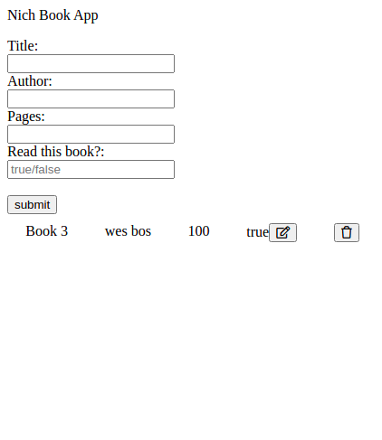

# my_library_app

> A library app that takes users input, stores it to localstorage and displays the data on the page



 - Has a form to add a book.
 - Validates the form fields
 - Has a button to remove a book.
 - Stores and Removes from local storage

## Built With

- Html, CSS, and JavaScript

## Live Demo

[Live Demo Link](https://my-library-app-murex.vercel.app/)

## Getting Started


To get a local copy up and running follow these simple example steps.

### Install

You can download the code to your personal computer clonig the repository using the following command

```
git clone
```

### Usage

To run this project you only need to open the index.html file in a web browser


## Authors

👤 **Nicholas Diamond**

- GitHub: [@Diamond](https://github.com/diamond-nicholas)
- LinkedIn: [Diamond Nicholas](https://www.linkedin.com/in/diamond-nicholas/)
- Twitter: [@diamondnich](https://twitter.com/diamondnich)

## 🤝 Contributing

Contributions, issues, and feature requests are welcome!

Feel free to check the [issues page](https://github.com/diamond-nicholas/my_library_app/issues).

## Show your support

Give a ⭐️ if you like this project!


## 📝 License

This project is [MIT](./LICENSE) licensed.